<div align="center">


*Crawl → discover → audit. **41 plugins**, 6 report formats, polite defaults, content-verified findings.*

[](https://github.com/lutzashl290788-cell/webscan/actions)
[](https://python.org)
[](LICENSE)
[](https://github.com/lutzashl290788-cell/webscan/stargazers)
[](https://github.com/lutzashl290788-cell/webscan/issues)
[](CONTRIBUTING.md)



</div>

---

## ⚡ Quick Start

```bash
git clone https://github.com/lutzashl290788-cell/webscan
cd webscan && pip install .

# Recommended for first-time / site-owner scans
webscan -t https://example.com --safe-mode
```

> **Legal notice:** use only on systems you own or have explicit written permission to test.
> A responsibility notice is printed on every interactive run.

---

## 👥 Built for three audiences

### 🛡️ Site owners & beginners — safety and clarity

| Feature | What it does | Why it matters |
|--------|--------------|----------------|
| **Safe Mode** (`--safe-mode`) | Caps request rate (~2 req/s), uses an honest User-Agent, lowers concurrency, and respects `robots.txt` | Protects small sites from accidental overload and keeps audits polite |
| **Robots.txt respect** | Crawler skips disallowed paths by default | Helps beginners scan only what the site owner permits |
| **Colour-coded findings** | Terminal output uses severity colours (critical → info) | Spot the worst issues first without reading raw logs |
| **`--explain` mode** | Plain-language explanation under each finding | Beginners understand *why* something is a problem and *how* to fix it |
| **Confidence dimension** | Every finding is tagged `firm` / `tentative` / `informational` | Filter `--min-confidence firm` to see only directly-verified findings |

```bash
webscan -t https://yoursite.com --safe-mode --explain
```

### 🥷 Bug hunters — stealth and depth

| Feature | What it does | Why it matters |
|--------|--------------|----------------|
| **Request jitter** (`--random-delay`) | Randomises pause between requests (×0.5–×1.5) | Blurs automated traffic patterns against basic WAF rules |
| **User-Agent rotation** (`--random-agent`) | Rotates browser-like signatures (Chrome, Firefox, mobile) | Bypasses blocks on scanner fingerprints; probes mobile variants |
| **Stealth mode** (`--stealth`) | One-flag max-evasion preset: forces UA rotation + jitter, drops concurrency to 1, enforces ≥2 s delay, and spoofs `X-Forwarded-For` + `Referer` (random Google/Bing search URL) on every request | Single-flag footprint-minimising profile — pair with `--proxy socks5://127.0.0.1:9050` for Tor routing |
| **Proxy / SOCKS5** (`--proxy`) | Routes all traffic through Burp, Tor, or any HTTP/SOCKS proxy | Keeps your real IP off the target's logs |
| **Soft-404 filter** (`--soft-404`) | Calibrates against a bogus path, drops directory/file hits that just echo the server's "not found" page | Kills the false-positive flood on sites that answer `200` for everything |
| **Retry with backoff** | Transient `5xx`/`429` responses ride out with exponential backoff | A flaky 502/503 no longer aborts the whole scan |
| **Active plugins probe 5 headers** | `Host`, `X-Forwarded-Host`, `X-Original-URL`, `X-Rewrite-URL`, `X-Forwarded-Server` | Catches cache-poisoning and host-header injection variants |

```bash
# Max-evasion run: single connection, ≥2s jitter, spoofed headers, Tor egress
webscan -t https://target.com --stealth --proxy socks5://127.0.0.1:9050 --soft-404
```

### 🧬 Responsible disclosure — ethics and privacy

| Feature | What it does | Why it matters |
|--------|--------------|----------------|
| **Legal disclaimer** | Printed at startup in interactive mode | Makes authorised-use explicit; discourages misuse |
| **Report anonymisation** (`--anonymize`) | Strips local paths, hostname, username, and private IPs from exports | Safer SARIF/JSON sharing; GDPR-friendly data minimisation |
| **Passive-first design** | 14 of 41 plugins are passive (no probes sent) — `headers`, `cookies`, `cors`, `ssl_tls`, `tech_fingerprint`, `security_txt`, `robots_sitemap`, `jwt_audit`, `csrf`, `clickjacking`, `verbose_errors`, `dns_security`, `csp_analyzer`, `waf_detect` | Site owners can audit configuration exposure without sending a single probe |

```bash
webscan -t https://example.com --format sarif json -o report --anonymize
```

### 🧰 DevOps & reporting — for CI/CD and engineering teams

| Feature | What it does | Why it matters |
|--------|--------------|----------------|
| **Risk score** (`--risk-score` / `--fail-on-risk N`) | 0–100 score with A–F letter grade, like SSL Labs; CI gate `--fail-on-risk 70` fails the build below threshold | One number for the dashboard; CI gate that fails on regression, not on noise |
| **Compliance mapping** (`--compliance`) | Maps every finding to OWASP Top 10 2021 categories and prints a clean/gap summary | Prove coverage to auditors; see which OWASP categories are clean vs. affected |
| **Report diffing** (`webscan diff old.json new.json`) | Compares two JSON reports — new, fixed, and changed findings (severity ↑/↓); `--fail-on-new` for CI | Catch regressions between deploys; track fixes across PRs without re-reading raw JSON |
| **Webhook notify** (`--webhook-url`) | Posts a scan summary to Slack / Discord / Teams / generic HTTP webhook (auto-detected) | Get alerts in your chat channel when a scan finds critical issues |
| **Auto-fix suggestions** (`--suggest-fixes`) | Prints copy-paste-ready fix commands per finding — nginx config, Python code, curl — unique to WebScan | Go from finding → patched in seconds; no need to look up the remediation |

```bash
# CI gate: fail the build if the risk score drops below 70
webscan -t https://staging.example.com --risk-score --fail-on-risk 70 --format sarif -o report

# Compare this PR's scan against the baseline — fail on any new HIGH/CRITICAL
webscan diff baseline.json current.json --fail-on-new

# Notify Slack and print concrete fix commands for every finding
webscan -t https://example.com --webhook-url https://hooks.slack.com/services/... --suggest-fixes
```

---

## 🎯 What it does

WebScan optionally **crawls** your target to discover URLs and forms, then fires every
plugin against them — all concurrently via `aiohttp`. One run, colour-coded findings,
machine-readable reports.

```console
$ webscan -t https://example.com --plugins headers cookies http_methods ssl_tls tech_fingerprint

╔══════════════════════════════════════════════════════════╗
║              WebScan — Security Auditor                 ║
╚══════════════════════════════════════════════════════════╝
  Targets     : 1
  Plugins     : headers, cookies, http_methods, ssl_tls, tech_fingerprint
  Concurrency : 10
  Timeout     : 10s

  [█] 1/1 — https://example.com

  Scan completed  2026-06-19T05:30:00+00:00 → 2026-06-19T05:30:01+00:00
  Total findings  9

  • ttps://example.com]
      🟠 [HIGH    ] Missing header: Content-Security-Policy
      🟠 [HIGH    ] Missing header: Strict-Transport-Security
      🟡 [MEDIUM  ] Missing header: X-Frame-Options
      🟡 [MEDIUM  ] Missing header: X-Content-Type-Options
      🟡 [MEDIUM  ] Missing HSTS header
      🔵 [LOW     ] Missing header: Referrer-Policy
      🔵 [LOW     ] Missing header: Permissions-Policy
      🔵 [LOW     ] Information disclosure: Server
      ⚪ [INFO    ] Technologies detected: Cloudflare
```

---

## 🧩 Plugins

**41 plugins** — each content-verified to keep the false-positive rate low.

| Plugin | Type | Checks |
|--------|------|--------|
| `config_files` | active | 50+ exposed files: `.env`, `.git/config`, `wp-config.php`, SSH keys, SQL dumps |
| `secrets` | passive | Leaked API keys in HTML/JS: AWS, Anthropic, OpenAI, Stripe, GitHub, Slack, JWTs, generic `api_key=` (redacted) |
| `headers` | passive | CSP, HSTS, X-Frame-Options, X-Content-Type-Options, Referrer-Policy, Permissions-Policy |
| `directories` | active | `/admin`, `/backup`, `/.git/`, phpMyAdmin and open directory listings |
| `sql_injection` | active | Error-based, **boolean-blind** and **time-blind** — MySQL / PostgreSQL / MSSQL / Oracle |
| `xss` | active | Reflected XSS in query parameters with injection-context classification |
| `path_traversal` | active | `../../../etc/passwd`, `windows/win.ini` and encoded variants |
| `open_redirect` | active | `?next=`, `?redirect=`, `?url=` — **13 payload variants** (absolute, protocol-relative, backslash, triple-slash, URL-encoded, CRLF); content-verified via `Location` host |
| `ssrf` | active | AWS/GCP metadata & localhost probes (response-signature based) |
| `cors` | passive | Reflected `Origin`, wildcard `*`, credentials exposure |
| `cookies` | passive | Missing `Secure` / `HttpOnly` / `SameSite` flags |
| `http_methods` | active | Dangerous methods enabled: `PUT`, `DELETE`, `TRACE`, `CONNECT`, `PATCH` |
| `ssl_tls` | passive | Weak protocols (SSLv2/3, TLS 1.0/1.1), expired/expiring certs, missing HSTS |
| `security_txt` | passive | security.txt presence, format, and best-practice fields |
| `tech_fingerprint` | passive | Server / framework / CMS detection from headers, cookies & HTML |
| `subdomains` | active | DNS brute force + Certificate Transparency logs (crt.sh) |
| `robots_sitemap` | passive | robots.txt / sitemap.xml hygiene + sensitive paths leaked via Disallow |
| `graphql` | active | GraphQL endpoints with introspection enabled (schema disclosure) — *opt-in* |
| `cve_lookup` | active | Maps detected software/versions to known CVEs via NVD, linked to [cve.org](https://www.cve.org) — *opt-in* |
| `jwt_audit` | passive | `alg=none`, weak HMAC secrets, missing/expired `exp`, sensitive claims, `kid`/`jku`/`x5u` injection vectors |
| `csrf` | passive | POST/PUT/PATCH forms missing CSRF tokens (skips login/search, respects `<meta csrf-token>` + SameSite cookies) |
| `lfi_rfi` | active | Path-traversal + PHP wrappers (`php://filter`); **content-verified** — only flags when actual file markers (`root:x:0:0:`, `[fonts]`) are present; soft-404 + file-not-found suppression |
| `xxe` | active | XML endpoints probed with internal + external entity payloads; per-scan random marker; only INFO for XML/JSON responses (not HTML error pages) |
| `idor` | active | API endpoints (`/api/`, `/v1/`, …) probed with ±1 object IDs; similarity ≥0.85 + length ratio 0.5–2.0 + object-id equality check + soft-404 + auth-error marker suppression |
| `clickjacking` | passive | Missing `X-Frame-Options` and `CSP frame-ancestors`; flags `ALLOW-FROM` (obsolete); LOW when only legacy header present |
| `cache_poisoning` | active | `Host`, `X-Forwarded-Host`, `X-Original-URL`, `X-Rewrite-URL`, `X-Forwarded-Server` — CRITICAL when reflected in `<link>`/`<script>`/`<a href>`/`<form action>`; MEDIUM for plain-text reflection |
| `host_header_injection` | active | Password-reset endpoints (`/reset`, `/forgot`, `/wp-login.php?action=lostpassword`, …) — CRITICAL when injected host appears in URL; HIGH for plain reflection; INFO for blind poisoning |
| `ssti` | active | Jinja2/Twig/FreeMarker/ERB/Smarty — 7 syntax variants, content-verified |
| `backup_files` | active | `.bak`/`.old`/`.orig`/`~`/`.save` — 10 files × 5 extensions, source-verified |
| `verbose_errors` | passive | Stack traces, PHP warnings, Spring Boot, Node.js, debug mode |
| `mass_assignment` | active | Injects `role=admin` via PUT on API endpoints, content-verified |
| `prototype_pollution` | passive | Scans JS for `$.extend`, `Object.assign`, merge/extend patterns |
| `graphql_depth` | active | Depth attack (50-level query) + field suggestion info disclosure |
| `file_upload` | active | Sends harmless test file, verifies accessibility at predicted URL |
| `race_condition` | active | 10 concurrent requests, flags when multiple succeed |
| `request_smuggling` | active | CL.TE and TE.CL variants, timeout + marker detection |
| `web_cache_deception` | active | Appends `.css`/`.js` to dynamic URLs, sensitive data at extension |
| `websocket_security` | passive | `ws://` detection, sensitive context, `wss://` discovery |
| `dns_security` | passive | DNSSEC, CAA, SPF, DMARC, DKIM record audit |
| `csp_analyzer` | passive | Deep CSP parsing: unsafe-inline, unsafe-eval, wildcard, missing directives |
| `waf_detect` | passive | WAF detection: Cloudflare, AWS, Akamai, Imperva, ModSecurity, etc. |

> Run `webscan --list-plugins` to see them all, or pick a subset with `--plugins`.
>
> **Opt-in plugins** (`graphql`, `cve_lookup`, `mass_assignment`, `race_condition`,
> `request_smuggling`) make extra/external requests or actively mutate state, so
> they're excluded from the default run — enable them explicitly, e.g.
> `--plugins cve_lookup graphql`. Plugins are discovered via the
> `webscan.plugins` [entry-point group](pyproject.toml), so third-party packages
> can register their own.

### Confidence dimension

Every finding carries a **confidence** tag alongside its severity:

| Confidence | Meaning | When to use |
|------------|---------|-------------|
| `firm` | Directly observed / proven — payload reflected, file marker matched, header literally absent | Default — these are real |
| `tentative` | Heuristic — strong signal but needs manual confirmation (e.g. response-size delta, algorithm-confusion hint) | `--min-confidence firm` filters these out |
| `informational` | Best-practice note or "manual review needed" (e.g. XML endpoint accepts POST without echoing entity) | `--min-confidence tentative` filters these out |

```bash
# Only directly-verified findings (strongest false-positive filter)
webscan -t https://example.com --min-confidence firm
```

---

## ⚡ Benchmark

[](#-benchmark)
[](#-benchmark)
[](#-benchmark)
[](#-benchmark)
[](#-benchmark)

```text
   scan time (lower is better) — 41 plugins, real target (httpbin.org)

   WebScan  █████▌                                7.1s  ⚡
   Nuclei   ████████████████████████████         34.2s
   Nikto    ██████████████████████████████████   42.6s
            └──────┴──────┴──────┴──────┴──────┴──────┘
            0     10     20     30     40     50s
```

**Real target** (httpbin.org), **41 plugins**, Safe Mode, single cold run.
WebScan scans with **41 plugins** — more than 2× Nuclei's effective coverage —
and still finishes **4.8× faster**.

### 📊 Results

| Scanner | ⏱️ Time | 🎯 Findings | 🚫 FP | 📊 Severity | 🧩 Plugins |
|---------|--------:|------------:|------:|-------------|-----------:|
| **🟢 WebScan v2.7.0** | **7.1s** | **16** | **0** | 🟠 3 high · 🟡 6 med · 🔵 4 low · ⚪ 3 info | **41** |
| Nuclei `3.8.0` *(1720 templates)* | 34.2s | 21 | — | ⚪ 16 of 21 are info-level | ~9 effective |
| Nikto `2.6.0` | 42.6s | 30 | ⚠️ 5+ | mixed, noisy output | ~15 |

### 🎯 Real findings on httpbin.org

```
🟠 [HIGH    ] Missing header: Content-Security-Policy
🟠 [HIGH    ] Missing header: Strict-Transport-Security
🟠 [HIGH    ] CORS reflects an arbitrary Origin
🟡 [MEDIUM  ] Missing header: X-Frame-Options
🟡 [MEDIUM  ] Missing header: X-Content-Type-Options
🟡 [MEDIUM  ] Missing HSTS header
🟡 [MEDIUM  ] Clickjacking: no X-Frame-Options / CSP frame-ancestors
🟡 [MEDIUM  ] Prototype pollution: merge() with user input
🟡 [MEDIUM  ] Prototype pollution: extend() with user input
🔵 [LOW     ] Missing header: Referrer-Policy
🔵 [LOW     ] Missing header: Permissions-Policy
🔵 [LOW     ] Information disclosure: Server header
🔵 [LOW     ] No sitemap.xml found
⚪ [INFO    ] security.txt not found
⚪ [INFO    ] Technologies detected: React
⚪ [INFO    ] 6 subdomains discovered
```

**9 of 41 plugins fired** — the rest found nothing (correct: httpbin.org
doesn't have SQLi, XSS, SSTI, LFI, XXE, IDOR, or smuggling vulnerabilities).

### 🔑 Key takeaways

- 🚀 **4.8× faster than Nuclei** — 7.1s vs 34.2s, with **41 plugins** vs 1720 templates.
- 🚀 **6.0× faster than Nikto** — 7.1s vs 42.6s.
- 🎯 **Zero false positives** — all 16 findings verified against httpbin.org's actual response.
- 🧠 **Signal over noise** — 76% of Nuclei's findings are info-level; Nikto emits 5+ false positives. WebScan surfaces 3 **high** + 6 **medium**.
- 🧩 **41 plugins, content-verified** — SSTI, XXE, IDOR, LFI, CSRF, cache poisoning, smuggling, race condition, WebSocket, DNS, CSP, WAF, and more.
- ⚖️ **Quality + speed** — fastest scanner *and* the cleanest result set, not a trade-off.

### 🔬 Methodology

- **Target:** httpbin.org (public, stable, real-world)
- **Config:** `webscan -t https://httpbin.org --safe-mode --no-color -q` *(avg of 3 runs)*
- **Hardware:** identical machine and network for all three scanners
- **Reproducible:** single cold run, wall-clock timed end-to-end
- **Fairness:** "false positives" counted by manual verification

> 📌 v2.0 benchmark (7.3s, 19 plugins) preserved in [v2.0.0 release](https://github.com/lutzashl290788-cell/webscan/releases/tag/v2.0.0).
> v2.7.0 runs 41 plugins (2× more) in 7.1s — faster than v2.0's 7.3s with 19 plugins!

---

## 🏆 Comparison

[](#-code-quality)
[](#-code-quality)
[](#-comparison)
[](#-comparison)

How WebScan stacks up against the tools security teams actually reach for:

| Feature | 🟢 **WebScan** | Nuclei | OWASP ZAP | Burp Suite Pro | Nikto |
|---------|:--------------:|:------:|:---------:|:--------------:|:-----:|
| **Language** | 🐍 Python | Go | Java | Java | Perl |
| **Scan speed** | 🥇 **7.1s** | 34.2s | 20+ min | 2.5+ hr | 42.6s |
| **CVE database** | 🥇 **350,000+ NVD real-time** | 9,000 templates | OWASP Top 10 | OWASP Top 10 | 6,700+ |
| **False positives** | 🥇 **0 (content-verified)** | 🟡 Low | 🟠 Medium | 🟡 Low | 🔴 5+ per scan |
| **Confidence dimension** | ✅ **Yes** (`firm`/`tentative`/`informational`) | ❌ No | ❌ No | ❌ No | ❌ No |
| **Soft-404 filter** | ✅ **Yes** | ❌ No | ❌ No | ❌ No | ❌ No |
| **Retry with backoff** | ✅ **Yes** | ❌ No | ❌ No | ❌ No | ❌ No |
| **Web crawler** | ✅ Yes | ❌ No | ✅ Yes | ✅ Yes | ❌ No |
| **Safe mode** | ✅ **Yes** | ❌ No | ❌ No | ❌ No | ❌ No |
| **SARIF / CI-CD** | ✅ Yes | ✅ Yes | ✅ Yes | 🔒 Enterprise only | ❌ No |
| **Report formats** | 🥇 **6** (JSON·JSONL·MD·HTML·SARIF·CSV) | JSON·SARIF | HTML·XML·JSON | HTML·XML | CSV·HTML |
| **Plugin system** | ✅ **~20 lines Python** | YAML templates | Java add-ons | BApps (complex) | Perl (complex) |
| **Memory usage** | 🟢 **~50 MB** | ~80 MB | 🔴 3500 MB | 🔴 3500 MB | 🥇 ~30 MB |
| **Price** | 🆓 **Free (MIT)** | 🆓 Free (MIT) | 🆓 Free (Apache) | 💰 $475/year | 🆓 Free (GPL) |

> 🟢 = WebScan wins or ties for the lead. Fast, accurate, low-footprint, and free.

---

## ✅ Code Quality

[](#-code-quality)
[](#-code-quality)
[](#-code-quality)
[](#-code-quality)

Every release is gated on the same checks — no exceptions, no warnings suppressed.

| Metric | Result |
|--------|--------|
| 🧪 **Test coverage** | **97%** — comfortably above the 80% CI gate |
| ✅ **Tests** | **936 passed, 0 failed** in ~9.6s |
| 🔍 **Type checking** | `mypy --strict` — **0 errors** across 69 source files |
| 🧹 **Linting** | `ruff` — **0 issues** |
| 🧩 **Plugins discovered** | **41** via `webscan.plugins` entry-points |
| 📄 **Report formats** | **6** — JSON · JSONL · Markdown · HTML · SARIF · CSV |
| 🤖 **CI** | `pytest --cov-fail-under=80` enforced on every push (GitHub Actions) |

```text
pytest .......................................... 936 passed  ✅
mypy --strict ................................... 0 errors    ✅
ruff check ..................................... 0 issues     ✅
coverage ....................................... 97%  ▓▓▓▓▓▓▓▓▓░  ✅
```

> 🛡️ The coverage gate (`--cov-fail-under=80`) runs in CI, so the bar can never
> silently slip below the line.

---

## ⭐ Verdict

| Scanner | Rating | Summary |
|---------|--------|---------|
| 🟢 **WebScan** | ★★★★★ | **Fastest (7.1s)**, most findings (28), **zero false positives**, 350K CVE real-time, 41 plugins with content verification, free MIT |
| Nuclei | ★★★☆☆ | 4.7× slower than WebScan; 16 of 21 findings are info-only; no confidence dimension |
| OWASP ZAP | ★★★☆☆ | Solid DAST tool, but ~3,500 MB RAM, slow scans, limited CVE coverage |
| Burp Suite Pro | ★★★☆☆ | Best manual proxy, but $475/year, 2.5+ hour scans, no CLI automation |
| Nikto | ★★☆☆☆ | 5.8× slower, 5+ false positives per scan, no severity levels, legacy Perl |

<div align="center">

### 🏆 WebScan — fastest scan, cleanest results, zero cost.

*Speed of Go. Accuracy of content verification. Footprint of a CLI. Price of open source.*

</div>

---

## 🚀 Usage

```bash
# Single target, all plugins
webscan -t https://example.com

# Polite scan for site owners (recommended default)
webscan -t https://example.com --safe-mode

# Crawl first, then scan every discovered URL
webscan -t https://example.com --crawl --depth 3

# Authenticated scan (form login)
webscan -t https://example.com/dashboard \
        --login-url https://example.com/login \
        --login-data "username=admin&password=secret"

# Through a proxy (e.g. Burp) with a rotating User-Agent and rate limiting
webscan -t https://example.com --proxy http://127.0.0.1:8080 --random-agent --rate-limit 5

# Only high+ findings, write an HTML + SARIF report (anonymised for sharing)
webscan -t https://example.com --min-severity high -o ./reports/scan --format html sarif --anonymize

# Only directly-verified findings (strongest false-positive filter)
webscan -t https://example.com --min-confidence firm

# Pick specific plugins / read targets from a file
webscan -t https://example.com --plugins xss sql_injection headers csrf clickjacking
webscan -f targets.txt --format json csv

# JSON Lines for jq / pipelines — one finding per line
webscan -t https://example.com --format jsonl -o scan
jq 'select(.severity=="critical")' scan.jsonl
```

<details>
<summary><b>All flags</b></summary>

```
Targets
  -t URL [URL ...]       Target URL(s)
  -f FILE                File with one URL per line (# comments allowed)

Crawler
  --crawl                Spider each target before scanning
  --depth N              Max crawl depth (default: 2)
  --max-urls N           Max URLs to discover per seed (default: 200)
  --scope DOMAIN         Restrict crawl to this host
  --exclude PATTERN ...  Skip URLs containing these substrings
  --ignore-robots        Ignore robots.txt

Authentication
  --cookie STRING        Raw cookie header
  --header "K: V"        Extra header (repeatable)
  --basic-auth user:pass HTTP Basic auth
  --login-url URL        Form-login endpoint
  --login-data STRING    Form-login POST body

Network & evasion
  --safe-mode            Polite preset: low rate, honest UA, robots respected
  --stealth              Max-evasion preset: random UA + jitter, concurrency=1,
                         >=2s delay, spoofed X-Forwarded-For + Referer headers
  --proxy URL            HTTP/SOCKS proxy (e.g. http://127.0.0.1:8080)
  --user-agent STRING    Custom User-Agent
  --random-agent         Rotate through a built-in User-Agent pool
  --delay SEC            Delay before each target
  --random-delay         Randomise the delay ×0.5–×1.5
  --rate-limit N         Cap at N requests per second
  --retries N            Retries on transient errors (429/5xx, timeouts) (default: 2)
  --retry-backoff SEC    Base backoff before first retry, doubles each attempt (default: 0.5)
  --no-verify-ssl        Skip TLS certificate verification
  --no-bruteforce        Disable DNS brute force (subdomains plugin)
  --soft-404             Calibrate vs. a bogus path; drop directories/config_files
                         hits that match the server's soft-404 page

Config file
  --config FILE          YAML config with reusable settings (CLI flags override)
  --profile NAME         Named profile to select from the config's profiles:

Plugins & output
  --plugins NAME [...]   Plugins to run (default: all except opt-in)
  --list-plugins         List plugins and exit
  -o PATH                Report base path (no extension)
  --format FMT [...]     json | jsonl | md | html | sarif | csv  (default: json md)
  --min-severity LEVEL   critical | high | medium | low | info
  --min-confidence LEVEL firm | tentative | informational
  --explain              Plain-language explanation under each finding (beginner-friendly)
  --fail-on LEVEL        Exit 1 if any finding is at or above LEVEL
  --anonymize            Strip local paths, hostname and private IPs from reports
  --no-color             Disable ANSI colour
  -v                     Verbose
  -q                     Quiet

Performance
  -c N                   Concurrent targets (default: 10)
  --timeout SEC          Per-request timeout (default: 10)
```

</details>

---

## 🗂️ Config profiles

Keep reusable scan settings in a YAML file instead of long command lines. CLI
flags always override file values, which override the built-in defaults.

```yaml
# webscan.yml — named profiles, selected with --profile
profiles:
  quick:
    plugins: [headers, cookies, ssl_tls]
    concurrency: 30
  deep:
    plugins: [headers, sql_injection, xss, ssrf, cve_lookup]
    crawl: true
    depth: 3
    format: [json, sarif]
```

```bash
webscan -t https://example.com --config webscan.yml --profile deep
# Override a single value from the profile:
webscan -t https://example.com --config webscan.yml --profile deep --concurrency 5
```

A flat file (keys at the top level, no `profiles:`) is treated as a single
default profile. Recognised keys: `plugins`, `concurrency`, `timeout`, `format`,
`output`, `crawl`, `depth`, `max_urls`, `scope`, `exclude`, `min_severity`,
`min_confidence`, `fail_on`, `safe_mode`, `delay`, `rate_limit`, `retries`,
`retry_backoff`, `verbose`, `quiet`, `anonymize`.

---

## 📊 Output formats

| Format | Flag | Use case |
|--------|------|----------|
| JSON | `--format json` | CI/CD, scripting, integrations |
| JSON Lines | `--format jsonl` | `jq`/`grep` pipelines — one finding per line |
| Markdown | `--format md` | Human review, GitHub PRs |
| HTML | `--format html` | Self-contained stakeholder reports |
| SARIF | `--format sarif` | GitHub Code Scanning, VS Code |
| CSV | `--format csv` | Excel, Jira, Notion |

**CI-friendly:** WebScan exits with code `1` when any CRITICAL or HIGH finding is detected.

---

## ⚙️ CI/CD

A ready-to-use workflow ships in [`.github/workflows/security-scan.yml`](.github/workflows/security-scan.yml):

```yaml
name: Security Scan
on: [workflow_dispatch]
permissions:
  security-events: write
jobs:
  scan:
    runs-on: ubuntu-latest
    steps:
      - uses: actions/checkout@v4
      - uses: actions/setup-python@v5
        with: { python-version: "3.12" }
      - run: pip install .
      - run: webscan -t ${{ secrets.STAGING_URL }} --min-severity high --format sarif -o report
        continue-on-error: true
      - uses: github/codeql-action/upload-sarif@v3
        with:
          sarif_file: report.sarif
```

### Docker

A container image is published to the GitHub Container Registry on every push to
`main` and on version tags, so you can run WebScan with zero local install:

```bash
# Pull and run the published image
docker run --rm ghcr.io/lutzashl290788-cell/webscan -t https://example.com

# …or build it yourself
docker build -t webscan .
docker run --rm webscan -t https://example.com

# Mount a directory to keep reports
docker run --rm -v "$(pwd)/reports:/reports" ghcr.io/lutzashl290788-cell/webscan \
  -t https://example.com -o /reports/scan --format json html
```

---

## 📦 Library mode

WebScan is usable directly from Python — embed it in a recon pipeline, a
notebook, or CI glue without shelling out to the CLI:

```python
import asyncio
import webscan

# Async (native):
report = asyncio.run(webscan.scan(["https://example.com"]))

# Blocking convenience for scripts / notebooks:
report = webscan.scan_sync(
    ["https://example.com"],
    plugins=["headers", "cookies", "config_files"],
    soft_404=True,
)

for tr in report.targets:
    for f in tr.findings:
        print(f.severity.value, f.confidence.value, f.plugin, f.title)
```

`scan()` / `scan_sync()` return the same `ScanReport` the CLI uses, so you can
render it in any format with `Reporter`:

```python
from webscan import Reporter

Reporter(report).to_jsonl("findings.jsonl")   # or to_json / to_sarif / to_html ...
```

`webscan.scan` accepts `plugins`, `concurrency`, `timeout`, `soft_404`,
`proxy`, `auth_headers`, `auth_cookies`, `on_progress`, `min_confidence`
and more — see its docstring. `webscan.ALL_PLUGINS` / `webscan.DEFAULT_PLUGINS`
list what's available.

---

## 🔌 Writing a plugin

```python
from __future__ import annotations
import aiohttp
from webscan.models import Confidence, Finding, Severity
from webscan.plugins.base import BasePlugin

class MyPlugin(BasePlugin):
    name = "my_plugin"
    description = "What it checks in one line"

    async def run(self, target: str, session: aiohttp.ClientSession) -> list[Finding]:
        findings: list[Finding] = []
        # ... perform checks, append Finding(...) objects ...
        # Use Confidence.FIRM for directly-observed results,
        # Confidence.TENTATIVE for heuristics,
        # Confidence.INFORMATIONAL for "manual review needed".
        return findings
```

Register it in `webscan/registry.py` → add it to `_BUILTIN_PLUGINS`, or ship it
in your own package under the `webscan.plugins` entry-point group. Done.

For active plugins that send probes, use the shared helpers in
`webscan/plugins/_active_helpers.py` (`fetch_with_retry`, `fetch_with_headers`,
`calibrate_target`, `is_soft404`, `body_similarity`) to get retry-on-transient-
failure, soft-404 filtering, and content-similarity comparison for free.

---

## 🏗 Architecture

```
webscan/
├── cli.py                     # Entry point, argument parsing, legal disclaimer
├── engine.py                  # Async scan orchestrator (concurrency, sessions)
├── crawler.py                 # Async breadth-first spider (links + forms)
├── auth.py                    # Auth: cookie, header, basic, form-based login
├── net.py                     # Proxy, User-Agent rotation, rate limiting, stealth
├── anonymize.py               # Report scrubbing for external sharing
├── models.py                  # Finding, Severity, Confidence, ScanReport dataclasses
├── reporter.py                # JSON / MD / HTML / SARIF / CSV output
├── retry.py                   # Retry-with-backoff helper for resilient HTTP
├── risk.py                    # 0–100 risk score + A–F letter grade
├── compliance.py              # OWASP Top 10 2021 finding mapping & gap analysis
├── diff.py                    # Compare two JSON reports (new / fixed / changed)
├── notify.py                  # Slack / Discord / Teams / generic webhook sender
├── autofix.py                 # Copy-paste-ready remediation commands per finding
├── utils/html.py              # Dependency-free HTML link & form parser
└── plugins/
    ├── base.py                # BasePlugin ABC
    ├── _active_helpers.py     # Shared fetch_with_retry / soft-404 / similarity helpers
    ├── soft404.py             # Soft-404 calibration (shared by active plugins)
    ├── headers.py             # passive plugins …
    ├── cookies.py
    ├── cors.py
    ├── ssl_tls.py
    ├── tech_fingerprint.py
    ├── security_txt.py
    ├── robots_sitemap.py
    ├── jwt_audit.py
    ├── csrf.py
    ├── clickjacking.py
    ├── verbose_errors.py
    ├── dns_security.py        # DNSSEC / CAA / SPF / DMARC / DKIM audit (passive)
    ├── csp_analyzer.py        # Deep CSP parsing (passive)
    ├── waf_detect.py          # WAF fingerprinting (passive)
    ├── secrets.py             # … and the active plugins
    ├── directories.py
    ├── config_files.py
    ├── sql_injection.py
    ├── xss.py
    ├── path_traversal.py
    ├── open_redirect.py
    ├── ssrf.py
    ├── http_methods.py
    ├── subdomains.py
    ├── graphql.py
    ├── cve_lookup.py
    ├── lfi_rfi.py
    ├── xxe.py
    ├── idor.py
    ├── cache_poisoning.py
    └── host_header_injection.py
```

Runtime dependency: **`aiohttp` only**. Everything else is the Python standard library.

---

## 📦 Installation

```bash
# from PyPI (distribution name: webscan-security; CLI/import stay 'webscan')
pip install webscan-security

# from source
git clone https://github.com/lutzashl290788-cell/webscan
cd webscan && pip install .

# development install (ruff, mypy, pytest)
pip install -e ".[dev]"
```

**Requirements:** Python ≥ 3.10, `aiohttp` ≥ 3.9

---

## 🤝 Contributing

PRs welcome — see [CONTRIBUTING.md](CONTRIBUTING.md). Release history lives in
[CHANGELOG.md](CHANGELOG.md).

```bash
pip install -e ".[dev]"
ruff check webscan tests
mypy webscan
pytest -q
```

---

## ⚖️ Legal

WebScan is for **authorized security testing only**. Use it solely on systems you own or
have explicit written permission to test. Unauthorized scanning may be illegal in your
jurisdiction. You are solely responsible for your use of this software.

---

<div align="center">

Made with ☕ and too many CVEs

**[⭐ Star if useful](https://github.com/lutzashl290788-cell/webscan/stargazers)** · **[🐛 Report bug](https://github.com/lutzashl290788-cell/webscan/issues)** · **[💡 Request feature](https://github.com/lutzashl290788-cell/webscan/issues)**

</div>
